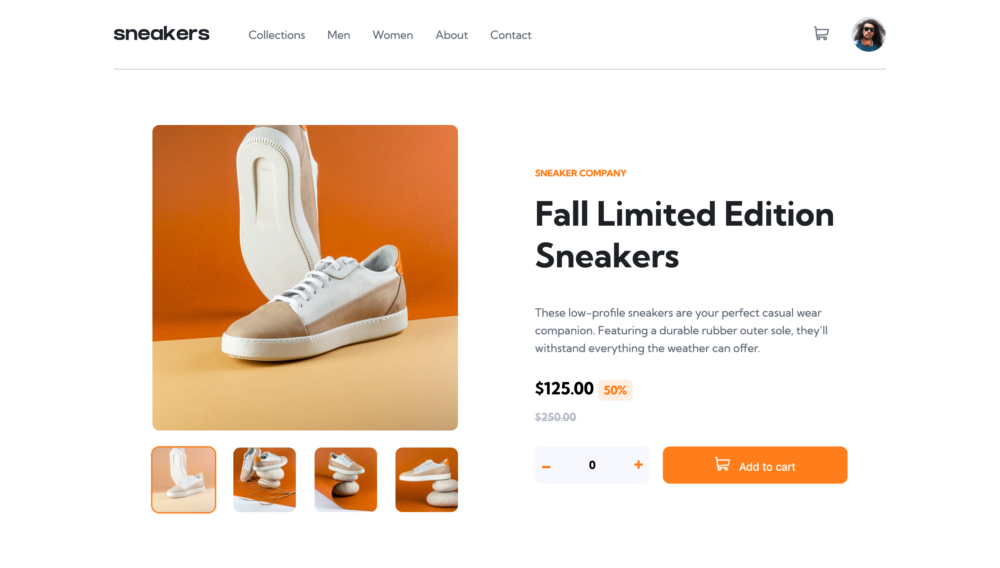

# Frontend Mentor - E-commerce product page solution

This is a solution to the [E-commerce product page challenge on Frontend Mentor](https://www.frontendmentor.io/challenges/ecommerce-product-page-UPsZ9MJp6). Frontend Mentor challenges help you improve your coding skills by building realistic projects.

## Table of contents

- [Overview](#overview)
  - [The challenge](#the-challenge)
  - [Screenshot](#screenshot)
  - [Links](#links)
  - [Built with](#built-with)
  - [Continued development](#continued-development)
- [Author](#author)

## Overview

### The challenge

Users should be able to:

- View the optimal layout for the site depending on their device's screen size
- See hover states for all interactive elements on the page
- Open a lightbox gallery by clicking on the large product image
- Switch the large product image by clicking on the small thumbnail images
- Add items to the cart
- View the cart and remove items from it

### Screenshot

### Links

- Solution URL: [https://www.frontendmentor.io/solutions/ecommerce-website-using-semantic-html5-markup-css3-and-es6-0LfmSv2-K4](https://www.frontendmentor.io/solutions/ecommerce-website-using-semantic-html5-markup-css3-and-es6-0LfmSv2-K4)
- Live Site URL: [https://bahadurshax.github.io/E-commerce/](https://bahadurshax.github.io/E-commerce/)

### Built with

- Semantic HTML5 markup
- CSS custom properties
- Flexbox
- ES6

### Continued development

I am planning to learn more about web accessibility and HTML semantics.

## Author

- Frontend Mentor - [@Bahadurshax](https://www.frontendmentor.io/profile/Bahadurshax)